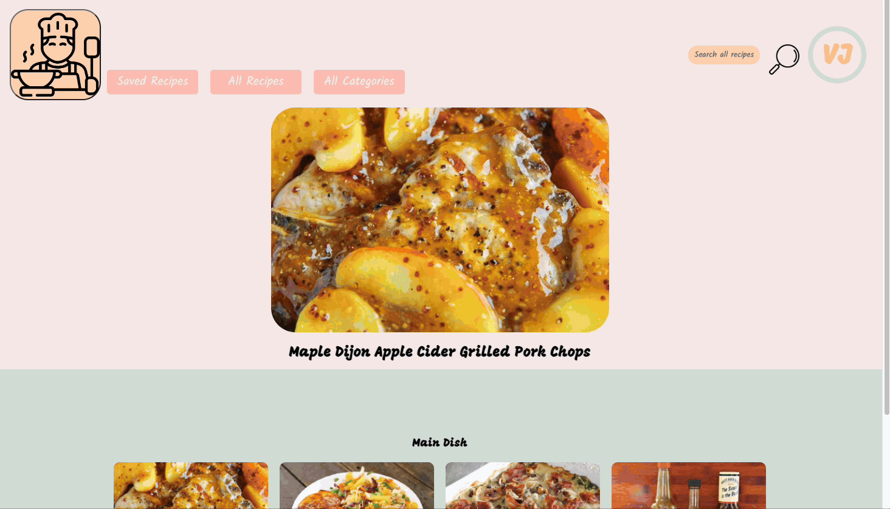

# What's Cookin!

## Table of Contents
* [Description](#Description)
* [Learning Goals](#Learning-Goals)
* [Features](#Features)
* [Installation](#Installation)
* [Contributors](#Contributors)
* [Technologies Used](#Technologies-Used)

## Description
Welcome to What's Cookin! - your go-to website for cooking and baking inspiration. Discover a wide range of dinner ideas and delightful desserts. On our home page, you'll find the Recipe of the Day and a featured category. Feel free to use the search bar, browse by category, or explore all recipes. Each recipe provides a list of ingredients, total price, and directions. Save your recipes to cook by clicking the ❤️ icon in the top right corner and visiting your saved recipes on the "Saved Recipes" page. Once saved, a grocery list is displayed on the "Saved Recipes" page showing quantities of the required ingredients to cool all your saved recipes along with a total budget. 

## Learning Goals
- Use object and array prototype methods to perform data manipulation
- Create a user interface that is easy to use and clearly displays information.
- Write DRY, reusable code that follows SRP and trends toward function purity
- Implement a robust testing suite using TDD
- Make network requests to retrieve, post and delete data
- Collaborate productively and professionally as a team. Ensure all team members are able to be heard and contribute throughout the project.
- Complete usability testing and incorporate any feedback that would improve the user experience
- Archive 100% accessibility audit score using the Lighthouse dev tool

## Features
- Upon page load, you'll find randomized user initials displayed in the top right corner, along with a random Recipe of the Day and a featured category for added variety and excitement:

- View all recipes, choose a category, or search by name/category while being able to navigate to the home screen by clicking our icon:

- Click on a recipe to see recipe details including ingredients, total cost, and instructions to make the food item. Click the ❤️ icon in the top right corner and visit your saved recipes on the "Saved Recipes" page:

- While viewing your saved recipes, you can search through them by name or by choosing a category; as well as delete them by clicking the x or unhearting it. The ingredients with quantities and a total budget will be displayed on the saved recipes page:

## Installation
1. `fork` this repository and/or `clone` it to local
1. Once you have cloned the repo, change (cd) into the directory and install the project dependencies. Run `npm install` or `npm i` to install project dependencies.
1. Run `npm test` to see tests
1. Run `npm run lint` if you would like to see the linter
1. Setup local server by cloning the following repo into another directory: https://github.com/turingschool-examples/whats-cookin-api
    - Follow the instructions in the repo's readme to get it setup
1. Inside the server directory, run `npm start`
1. Inside the project directory run `npm start` and visit `localhost:8080`

## Contributers
- [Alec Livaditis](https://github.com/alivaditis)
- [Calli Herrmann](https://github.com/CaliHam/)
- [Jason Alberto](https://github.com/jalbe0076)
- [Paulina Rubio](https://github.com/paulina-isabel)

## Technologies Used
- JavaScript (ES6)
- CSS
- HTML
- Mocha
- Chai
- Webpack
- Fetch API